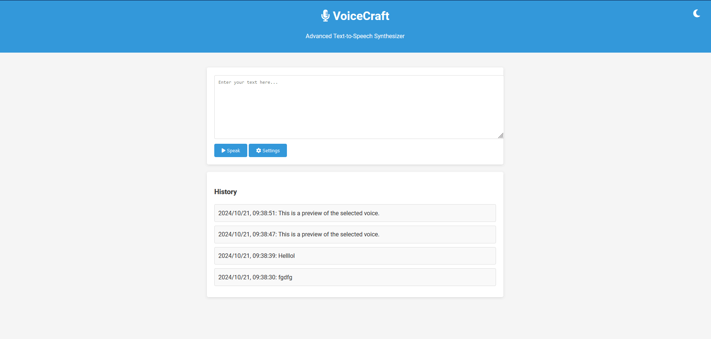

# VoiceCraft: Advanced Text-to-Speech Synthesizer

VoiceCraft is a web-based text-to-speech synthesizer that leverages the Web Speech API to convert text into spoken words. It offers a user-friendly interface with features like voice selection, pitch and rate adjustment, dark mode, and a history of recent conversions.

## How It Works



The GIF above demonstrates the basic functionality of VoiceCraft:

1. Enter text in the input area
2. Click the "Speak" button to hear the text
3. Adjust settings like voice, pitch, and rate
4. Toggle dark mode for comfortable viewing

## Features

- Text-to-speech conversion
- Multiple voice options
- Adjustable speech pitch and rate
- Dark mode for comfortable viewing
- History of recent text-to-speech conversions
- Responsive design for various screen sizes

## Technologies Used

- HTML5
- CSS3
- JavaScript (ES6+)
- Web Speech API

## Getting Started

To run VoiceCraft on your local machine, follow these steps:

1. Clone the repository:

   ```
   git clone https://github.com/siyabongaprospersithole/voicecraft.git
   cd voicecraft
   ```

2. Start the PHP built-in server:

   ```
   php -S localhost:8000
   ```

3. Open your web browser and navigate to:
   ```
   http://localhost:8000
   ```

## Project Structure

- `index.html`: The main HTML file containing the structure of the application.
- `js/`: Directory containing all JavaScript files:
  - `app.js`: The main JavaScript file that initializes the application.
  - `controllers/speechController.js`: Handles user interactions and controls the flow of the application.
  - `models/speechModel.js`: Contains the core functionality for text-to-speech conversion and manages the application state.
  - `views/viewManager.js`: Manages the visibility of different views in the application.
  - `utils/domHelpers.js`: Provides utility functions for DOM manipulation.
- `assets/`: Contains images and GIFs used in the project and documentation.

## Usage

1. On the welcome screen, click "Get Started" to begin.
2. Enter the text you want to convert to speech in the text area.
3. Click the "Speak" button to hear the text spoken aloud.
4. Use the "Settings" button to adjust the voice, pitch, and rate of the speech.
5. The "History" section shows your recent text-to-speech conversions. Click on an item to load it into the text area.
6. Toggle dark mode using the moon/sun icon in the top-right corner.

## Browser Compatibility

VoiceCraft works best on modern browsers that support the Web Speech API. It has been tested on the latest versions of:

- Google Chrome
- Mozilla Firefox
- Microsoft Edge

Note: Some features may not work on older browsers or browsers with limited Web Speech API support.

## Contributing

Contributions to VoiceCraft are welcome! Please feel free to submit a Pull Request.

## License

This project is open source and available under the [MIT License](LICENSE).
